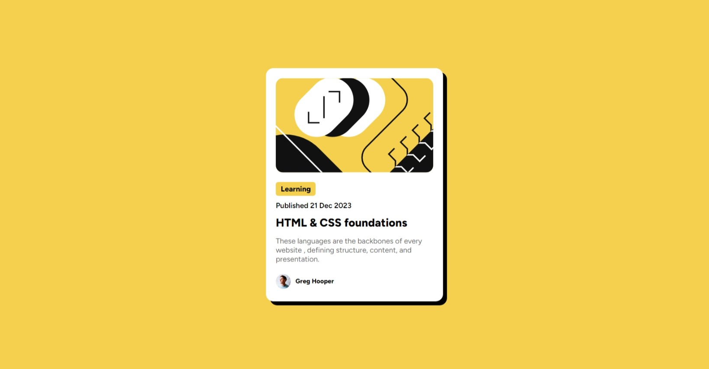

# Frontend Mentor - Blog preview card

## 1. Overview

The challenge is to build out this blog preview card and get it looking as close to the design as possible.


### a) My screenshot



### b) Links

- Solution URL: [my source code here](https://github.com/hieutrantrong21520859MMCL21/FrontEndPractice_Intern_BlogPreviewCard)
- Live Site URL: [my website's URL here](https://hieutrantrong21520859mmcl21.github.io/FrontEndPractice_Intern_BlogPreviewCard/)

## 2. My process

### a) Built with

- Semantic HTML5 markup
- CSS custom properties
- [Styled Components](https://styled-components.com/) - For styles

### b) What I learned

- How to import fonts from file .ttf to the project.
- How to apply hover effect.
- Some codes I am most proud of (which consist of knowledge I have learned):

```css
.card-title {
      margin-top: 12px;
      font-family: 'Figtree800', sans-serif;
      font-size: 20px;
      transition: all 0.2s linear;
      cursor: pointer;
}

 .card-title:hover {
      color: hsl(47, 88%, 63%);
}
```

### c) Useful resources

- [MDN - HTML](https://developer.mozilla.org/en-US/docs/Web/HTML): this helped me a lot about HTML via articles.
- [Learn HTML](https://web.dev/learn/html): this is an amazing website that provides lessons about HTML with examples.
- [MDN - CSS](https://developer.mozilla.org/en-US/docs/Web/CSS): this helped me well with CSS via articles.
- [Learn CSS](https://web.dev/learn/css): this is an amazing website that provides lessons about CSS with examples.